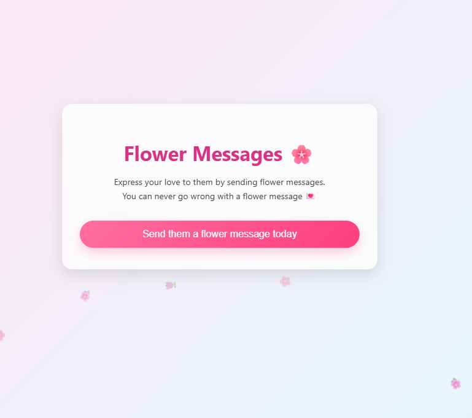
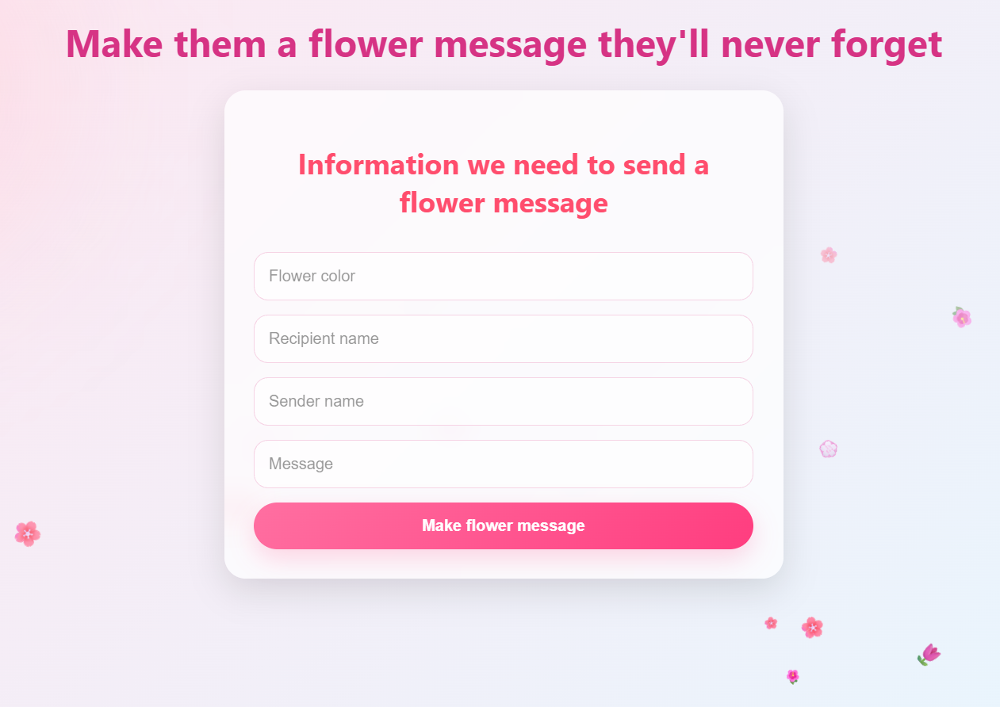
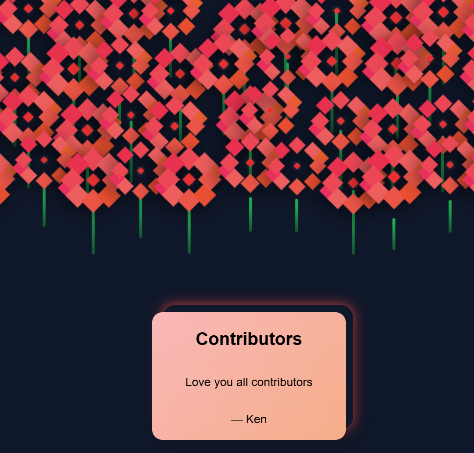

# 🌸 Flower Message App

> Create and share beautiful, personalized flower messages — powered by pure HTML, CSS, and JavaScript.

---

## 🔗 Live Demo

👉 **Visit the app:**
**https://your-site-url.com**

*(Replace with your actual deployed URL — GitHub Pages / Netlify / Vercel)*

---

## 📸 Screenshots

### 🏠 Home Page


### 🌼 Builder Page



### 💌 Message View



---

## ✨ Features

* 🌸 Create aesthetic flower-themed messages
* 🔗 Share messages via a simple URL
* ⚡ Instant rendering — no backend required
* 📦 Lightweight and fast (100% static)
* 🎨 Dynamic styling based on user input

---

## 🧠 How It Works

This app uses a clever **URL-based data system**:

1. User creates a message in `/builder`
2. Data is converted into JSON
3. Encoded using `btoa()` (Base64)
4. App generates a shareable link:

   ```
   /messages?data=ENCODED_STRING
   ```
5. `/messages` decodes it using `atob()` and renders the UI dynamically

---

## 📁 Project Structure

```
/
├── index.html
├── index.css
├── index.js
│
├── /builder
│   ├── index.html
│   ├── style.css
│   └── script.js
│
└── /messages
    ├── index.html
    ├── style.css
    └── script.js
```

---

## 🏠 Root Files

* `index.html` → Entry point / landing page
* `index.css` → Global styles
* `index.js` → Shared logic or routing

---

## 🔨 Builder (`/builder`)

* Collects:

  * Recipient name
  * Sender name
  * Message
  * Flower color
* Encodes data with `btoa()`
* Generates a shareable URL

---

## 💌 Messages (`/messages`)

* Reads URL parameters
* Decodes using `atob()`
* Parses JSON
* Dynamically updates:

  * Text content
  * Theme (color/hue)

---

## 🔐 Encoding Example

```js
const data = {
  recipient,
  sender,
  message,
  hue
};

const encoded = btoa(JSON.stringify(data));
const url = `${location.origin}/messages?data=${encoded}`;
```

---

## 🚀 Getting Started

```bash
# Clone the repo
git clone https://github.com/your-username/flower-message-app.git

# Open in browser
cd flower-message-app
open index.html
```

Or just open `/builder/index.html` directly.

---

## 🌐 Deployment (GitHub Pages)

1. Push your project to GitHub
2. Go to **Settings → Pages**
3. Select branch (e.g. `main`)
4. Set root folder (`/`)
5. Save

Your site will be live at:

```
https://your-username.github.io/flower-message-app/
```

---

## ⚠️ Limitations

* URL length limits (long messages may break)
* Base64 ≠ encryption (data is easily decoded)
* No persistence (no database)
* No editing after link generation

---

## 🎨 Future Improvements

* 🌺 Animations (floating petals, glowing effects)
* 🔒 Real encryption instead of Base64
* 🔗 URL shortening integration
* 📱 Better mobile UI/UX
* 💾 Optional backend for saved messages

---

## 🤝 Contributing

Contributions are welcome!

1. Fork the repo
2. Create a feature branch
3. Make your changes
4. Submit a pull request

---

## 📜 License

MIT License — feel free to use, modify, and share.

---

## 💡 Inspiration

This project shows how powerful **vanilla JavaScript** can be when combined with creativity.

No frameworks. No backend. Just ideas executed well.

---

## ❤️ Final Note

🌼 *A simple link can carry a beautiful message.*

If you like this project, consider ⭐ starring the repo!

---
